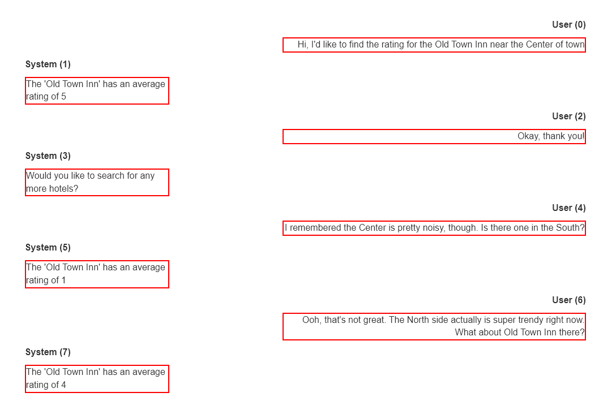

# Analyzing Eye-Gaze Trajectory of Task-Oriented Dialogue Transcripts



## Setup
### Installing Poetry

The project uses Poetry for packaging and dependency management. If you want to build it from source, you have to install Poetry first. This is how it can be done:

```bash
curl -sSL https://raw.githubusercontent.com/python-poetry/poetry/master/get-poetry.py | python
```

There are several other ways to install Poetry. Please, follow
[the official guide](https://python-poetry.org/docs/#installation) to see all possible options.

### Installing the dependencies
Run the following command to install the dependencies:
```bash
poetry install
```

## Running the server
To run the server, run the following command:
```bash
poetry run python app.py <path/to/log-file/from/eye-tracker>
```

If you are just running this without the eye-tracker, you can use `eye-tracking-experiments/after-spring-break.txt` as the log file.

